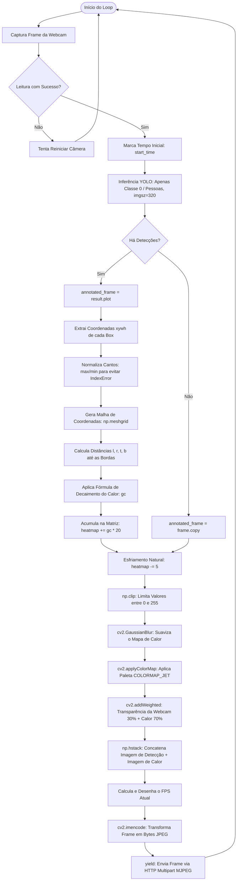
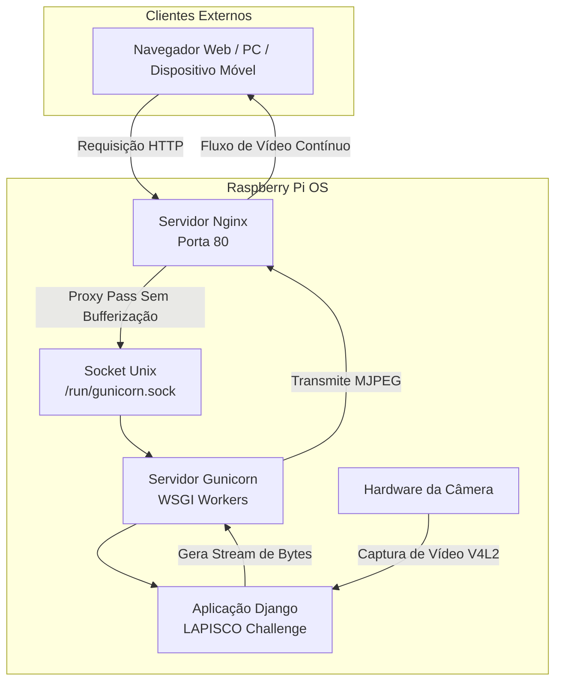

# 📊 LAPISCO CHALLENGE - Sistemas Embarcados

Solução de monitoramento inteligente desenvolvida para rodar em hardware de recursos limitados, como a Raspberry Pi. A aplicação captura o feed de vídeo da câmera, utiliza inteligência artificial de ponta (YOLO otimizada via NCNN) para detectar exclusivamente pessoas em tempo real e gera um mapa de calor acumulativo (Heatmap) dinâmico com efeito de dissipação natural. A arquitetura foi projetada seguindo padrões de nível de produção, utilizando Django no backend, Gunicorn como servidor de aplicação WSGI via sockets Unix, e Nginx como proxy reverso, garantindo segurança, estabilidade e baixa latência de streaming via protocolo Multipart MJPEG.

## Requisitos
- Raspberry Pi 3 ou superior(mínimo de 1GB de RAM)
- Câmera raspberry Pi ou Webcam USB
- Cartão MicroSD de pelo menos 32GB com adaptador
- Fonte própria para Raspberry Pi 3


## 🛠️ Tecnologias Utilizadas
- Framework Web & API: Django
- Engine de Inteligência Artificial: Ultralytics YOLO com backend NCNN (ncnn, pnnx) para inferência ultra-eficiente em CPU de embarcados.
- Processamento de Imagem & Visão Computacional: OpenCV (opencv-python-headless), NumPy e Matplotlib.
- Processamento Numérico e Científico: PyTorch (versão otimizada exclusivamente para CPU).
- Servidor de Produção & Infraestrutura: Gunicorn, Nginx e Systemd Linux Sockets.

## 💿 Instalação e Configuração do Raspberry Pi OS

### 1. Gravação do Sistema Operacional
Faça o download e instale o software oficial Raspberry Pi Imager em seu computador. Em seguida, instale o software Raspberry Pi OS em seu cartão MicroSD através do Raspberri Pi Imager e configurar o sistema operacional.
Essencialmente, é necessário configurar username, password, conexão Wifi(SSID) e autenticação SSH. Para mais detalhes [clique aqui](https://www.raspberrypi.com/documentation/computers/getting-started.html#install).

### 2. Primeiro Acesso e Atualizações Iniciais
Insira o cartão MicroSD gravado na Raspberry Pi, conecte a fonte de alimentação e aguarde cerca de dois minutos para a inicialização completa. 
Descubra o endereço IP atribuído à placa através do painel do seu roteador ou usando comandos de varredura de rede. Abra o terminal do seu computador e conecte-se à placa via SSH digitando o comando:
```ssh USERNAME_DA_SUA_RASPBERRY_PI@IP_DA_SUA_RASPBERRY_PI```
e inserindo a senha configurada no passo anterior. Uma vez dentro do terminal do sistema, execute o comando de atualização geral dos repositórios e pacotes do Linux rodando "sudo apt update && sudo apt upgrade -y".

### 3. Ativação da Câmera no Sistema
Se estiver utilizando o módulo de câmera oficial da Raspberry Pi conectado via cabo flat CSI, execute o comando "sudo raspi-config" para abrir a interface gráfica de configuração do sistema. Navegue utilizando as setas do teclado até o menu Interface Options, selecione a opção I2C ou Legacy Camera (dependendo da versão do seu sistema operacional) e confirme a ativação. Caso esteja utilizando uma webcam USB convencional, este passo não é necessário, pois o kernel do Linux reconhece o dispositivo automaticamente. Por fim, reinicie a placa executando o comando "sudo reboot" para aplicar todas as alterações de firmware e atualizações de pacotes.

## ⚙️ Configuração do Ambiente e Instalação

### 1. Clonar o Repositório e Atualizar o Sistema
Execute os comandos abaixo para clonar o projeto e instalar os pacotes globais do sistema necessários para processamento de vídeo e infraestrutura:
```
git clone https://github.com/Tobias-Costa/embeddedSystemsChallenge_LAPISCO.git
cd embeddedSystemsChallenge_LAPISCO
sudo apt update && sudo apt upgrade -y

# Se necessário
sudo apt install python3-pip python3-venv python3-dev ffmpeg libsm6 libxext6 nginx -y
```

### 2. Criar e Ativar o Ambiente Virtual (venv)
Garante o isolamento das dependências criando um ambiente virtual Python isolado dentro da pasta do projeto:
```
python3 -m venv venv
source venv/bin/activate
```

### 3. Instalar as Dependências
Execute o seguinte comando:
```
pip install -r requirements.txt
```

### 4. Configurar as Variáveis de Ambiente (.env)
Crie um arquivo .env na raiz do projeto Django para armazenar credenciais sensíveis de forma segura:
```
sudo nano .env
```
Abra o ficheiro e adicione as seguintes chaves de configuração:
```
SECRET_KEY=sua_chave_secreta_django_aqui
ALLOWED_HOSTS='IP_DA_SUA_RASPBERRY_PI'
````

## 🎛️ Configuração de Produção (Gunicorn Sockets + Nginx)

Para implantar a aplicação de forma persistente e escalável na Raspberry Pi, utilizaremos Sockets do Systemd para comunicação local rápida entre o Gunicorn e o Nginx.

### 1. Configurando o Gunicorn Socket
Crie o arquivo de escuta do socket do sistema executando o comando:
```
sudo nano /etc/systemd/system/gunicorn.socket
```

Adicione a seguinte configuração estrutural:
```
[Unit]
Description=gunicorn socket

[Socket]
ListenStream=/run/gunicorn.sock

[Install]
WantedBy=sockets.target
```

### 2. Configurando o Serviço do Gunicorn
Crie o arquivo do daemon do serviço responsável por gerenciar os processos em segundo plano:
```
sudo nano /etc/systemd/system/gunicorn.service
```
Insira o conteúdo abaixo, lembrando de ajustar o caminho ```/home/caminho/do/seu/projeto``` de acordo com o diretório correto do seu projeto:

```[Unit]
Description=gunicorn daemon
Requires=gunicorn.socket
After=network.target

[Service]
User=RASPBERRY_USERNAME
Group=www-data
WorkingDirectory=/home/caminho/do/seu/projeto/
ExecStart=/home/caminho/do/seu/projeto/venv/bin/gunicorn \
      --access-logfile - \
      --workers 1 \
      --timeout 0 \
      --bind unix:/run/gunicorn.sock \
      core.wsgi:application

[Install]
WantedBy=multi-user.target
```

### 3. Iniciar e Habilitar os Serviços do Gunicorn
Ative e configure o socket para iniciar automaticamente junto com a inicialização do sistema operativo:
```
sudo systemctl start gunicorn.socket
sudo systemctl enable gunicorn.socket
```

### 4. Configurando o Nginx como Proxy Reverso
Crie um arquivo de bloco de servidor (VirtualHost) para receber as requisições HTTP na porta padrão:
```
sudo nano /etc/nginx/sites-available/embeddedSystemsChallenge_LAPISCO
```
Adicione as seguintes diretivas, garantindo que o Nginx não armazene em cache ou faça bufferização da transmissão de vídeo contínua MJPEG:
```
server {
    listen 80;
    server_name localhost IP_DA_SUA_RASPBERRY_PI;

    location /favicon.ico { access_log off; log_not_found off; }
    
    location /static/ {
        root /home/caminho/do/seu/projeto/;
    }

    location / {
        include proxy_params;
        proxy_pass http://unix:/run/gunicorn.sock;
    }
}
```

Ative a configuração criando o link simbólico e reinicie o servidor web Nginx:
```
sudo ln -s /etc/nginx/sites-available/embeddedSystemsChallenge_LAPISCO /etc/nginx/sites-enabled/
sudo nginx -t
sudo systemctl restart nginx
sudo systemctl enable nginx
```

## 🚀 Como Utilizar a Aplicação

Para colocar o sistema em funcionamento, certifique-se de que a câmera ou webcam está conectada e ativada fisicamente na Raspberry Pi. Certifique-se também de que o serviço do Gunicorn está atualizado rodando o comando ```sudo systemctl restart gunicorn```. Abra o navegador de internet em qualquer dispositivo (computador, smartphone ou tablet) que esteja conectado na mesma rede local e digite o endereço IP correspondente à sua Raspberry Pi através do link: http://IP_DA_SUA_RASPBERRY_PI/.

## 🔌 Endpoints e Uso
- **Interface Web (`GET /person/detection`):** Painel de visualização principal. Acesse pelo navegador através do endereço local: `http://<IP_DA_RASPBERRY_PI>/`.
- **Stream de Vídeo (`GET /person/api`):** Retorna o fluxo binário contínuo do protocolo (`multipart/x-mixed-replace`). Pode ser consumido nativamente no HTML: ``.

## 📈 Métricas de Performance (FPS Esperado)
A taxa de quadros é calculada por cada ciclo interno de processamento da matriz através da fórmula: `FPS = 1.0 / tempo_do_ciclo`.
Durante as validações práticas utilizando o hardware limitado da Raspberry Pi 3, a aplicação atingiu um pico de desempenho estável de 2 FPS.

## 📚 Referências

As seguintes documentações e repositórios servem como base teórica e técnica para o desenvolvimento desta aplicação:
- [Ultralytics YOLO Documentation](https://docs.ultralytics.com/)
- [Django Docs](https://docs.djangoproject.com/en/6.0/)
- [Raspberry Pi Docs](https://www.raspberrypi.com/documentation/computers/getting-started.html)
- [Set Up Django with Postgres, Nginx, and Gunicorn on Ubuntu](https://www.digitalocean.com/community/tutorials/how-to-set-up-django-with-postgres-nginx-and-gunicorn-on-ubuntu)
- [Python: Creating a traffic heatmap using computer vision and artificial neural networks (YOLOv8)](https://medium.com/@fernando.dijkinga/python-creating-a-traffic-heatmap-using-computer-vision-and-artificial-neural-networks-yolov8-0ce2f0c3cd8a)
- [OCDet: Object Center Detection via Bounding Box-Aware Heatmap Prediction on Edge Devices with NPUs](https://arxiv.org/abs/2411.15653)
- [OpenCV & Python Full Course ](https://www.freecodecamp.org/news/opencv-full-course/)

---
  
## 🗺️ Arquitetura e Fluxo Lógico do Sistema

### Algoritmo



### Diagrama do sistema

